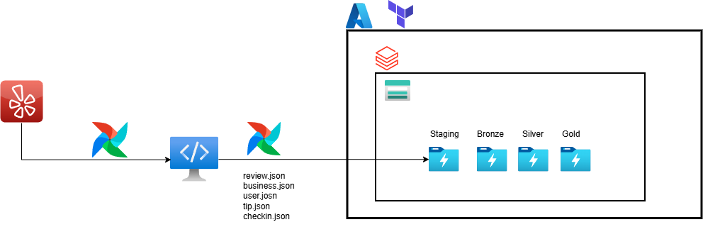

#  Yelp Pipeline (Batch) - Medallion Architecture - Azure
Pipeline de datos construido para ingerir datos de Yelp y procesarlos siguiendo una arquitectura Medallion (Bronze, Silver, Gold) utilizando Airflow y Azure.

## Objetivo del proyecto

Construir un pipeline end-to-end que:

1. Ingiera datos JSON de Yelp
2. Los almacene en un Data Lake
3. Procese los datos siguiendo arquitectura Medallion
4. Permita analítica y visualización
5. Explore modelos de Machine Learning o IA sobre los datos
---

## Arquitectura

## Tecnologías utilizadas

- Python
- Airflow
- Azure Data Lake
- Terraform
- Databricks / Spark

## Recursos
- Data: [yelp dataset](https://business.yelp.com/data/resources/open-dataset/)
- Terraform: 
    - [Azure](https://registry.terraform.io/providers/hashicorp/azurerm/latest/docs)
    - [Databricks](https://registry.terraform.io/providers/databricks/databricks/latest/docs)
- Airflow: [image](https://airflow.apache.org/docs/apache-airflow/stable/howto/docker-compose/index.html)
- Azure: [python API](https://learn.microsoft.com/en-us/python/api/azure-storage-blob/azure.storage.blob.blobserviceclient?view=azure-python), [azcopy](https://learn.microsoft.com/es-es/azure/storage/common/storage-use-azcopy-blobs-upload?toc=/azure/storage/blobs/toc.json&bc=/azure/storage/blobs/breadcrumb/toc.json)